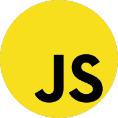
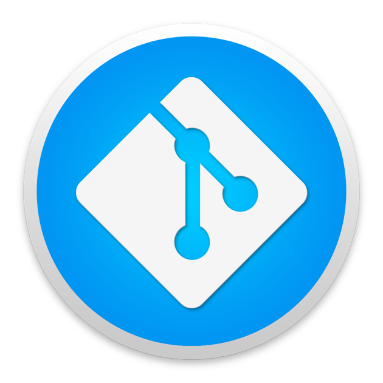
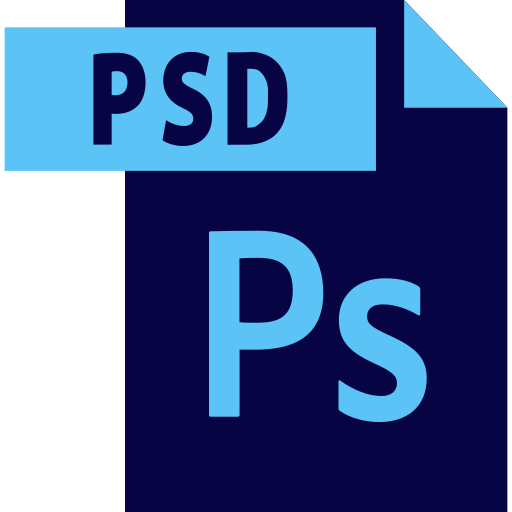
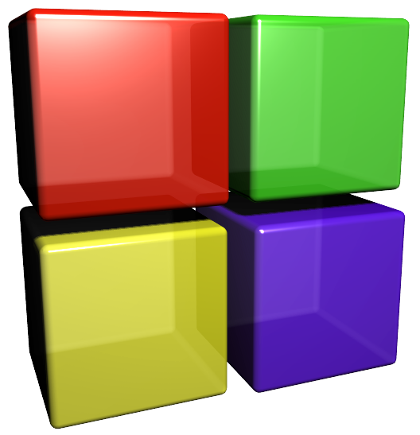

Hello, <Uth
🏠 &nbsp; Living: Dhaka, Bangladesh

💖 &emsp;I enjoy programming and sharing knowledge  
💻 &emsp;Most used line of code `console.log("Hello I am Akash")`  
🤔 &emsp;I’m looking for people who can enlighten me with amazing programming knowledge. 
📧 &emsp;How to reach me: Saikatkundu43@gmail.com.  
🤩 &emsp;Favorite Stack: MERN (MongoDB, Express, React, Node).  
⚡ &emsp;Fun fact: I never quit with the fear of loose, I looses with trying.
 
 
<!-- Contact me section starts here  -->

[][website]
[][facebook]
[][linkedin]
 
 
 

<!-- Contact me section ends here  -->

<!-- about-me section starts here  -->

### 👨‍🏫 &nbsp; About Me

I am a passionate SWE student. I have been learning programming languages, web development, and computer science-related subjects
to chase my dream 2 years till now.
After completing my Bsc. in Software Engineering I want to spending much time
improving my web development skills. Every day I want to learn something new and share my knowledge with others.

<!-- about-me section ends here  -->

<!-- web related skills section starts here  -->

### 👨🏽‍💻 &nbsp; My Skills:
<!-- Key skill here on web development  -->
#### Key Skills on Web development:

 
 

# 💻 Tech Stack:

 

  

   

# 📊 GitHub Stats:
 
 

---
-->

#### Other Skills:

 
 
 
 

-   MERN Stack
-   Database System
-   Object Oriented Programming
-   Java Swing
-   Discrete Math
-   Operating System
-   Learn for skill
-   MS Word
-   MS Excel
-   MS Powerpoint
-   Adobe Photoshop
    <!-- other skills and my videos for computer science section ends here  -->
 

### 💻 &nbsp;IDE & Code-Editors I Use:

 
 
 

<!-- other skills and my videos for computer science section starts here  -->

<!-- work experience section starts here  -->

<!---### 💼 &nbsp; Employment History

| Position            | Company                                   | Duration            | Location           |
| ------------------- | ------------------------------------------- | ------------------- | ------------------ |
| Full Stack Web Developer | NFC Technology                        | sept 2021-march2022   | Bangaluru, India   |
<!-- work experience section ends here  -->
<!-- education section starts here  -->

### 👨🏻‍🎓 &nbsp; Education

1. B.Sc. in Software Engineering (running)  
   Daffodil International University  

<!-- education section ends here  -->

<!-- my languages section starts here  -->
### 💬 &nbsp; Languages:

-   🇧🇩 Bangla : Native
-   🏴󠁧󠁢󠁥󠁮󠁧󠁿 English : Advanced
-   🇮🇳 Hindi : Intermediate

<!-- my languages section ends here  -->

<!-- my sports and game section starts here  -->
---
### 🎯 &nbsp; Sports / Game / Activities / Hobby:

-   🏏 Cricket, 🏸 Badminton, ♟️ Chess, 🎮 Gaming
-  💻 Web Designing, 🎥 Watching Movies
-   🏊‍♂️ Swimming, 🚶‍♂️ Walking, 
<!-- my sports and games section ends here  -->
<!-- Honors & awards section starts here  -->

<!-- ### 🏆 Honors & Awards :

-   Nothing Yet -->

---

Thanks for going through my Portfolio.
All rights reserved by Shaikot Kundu Akash @2020-Present

---

<!-- my award section ends here  -->
[website]: https://akash-portfolio-5b1d5.web.app/
[facebook]: https://www.facebook.com/saikat.akash1
[linkedin]: https://www.linkedin.com/in/shaikot-3009
[github]: https://github.com/Developer-Shaikot
